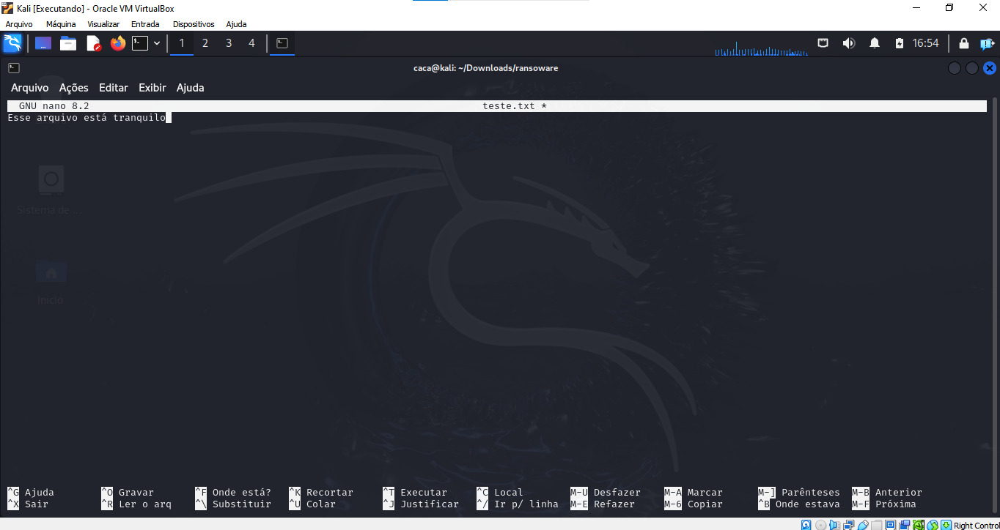

# Projeto de ransoware usando AES
## Montagem
- Crie uma pasta com o texto, encriptador e decriptador

- Coloque o algoritmo do encriptador usando a chave desejada

- Coloque o algoritmo do decriptador usando a chave desejada

- Coloque o texto desejado

## Resultados

